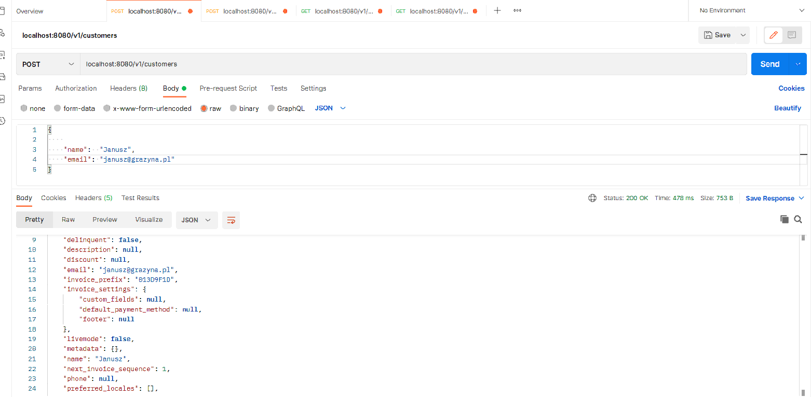
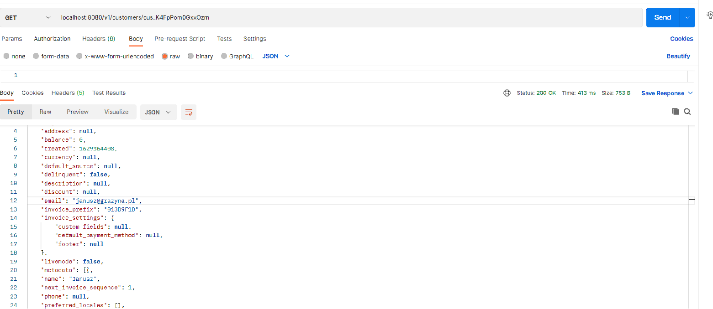
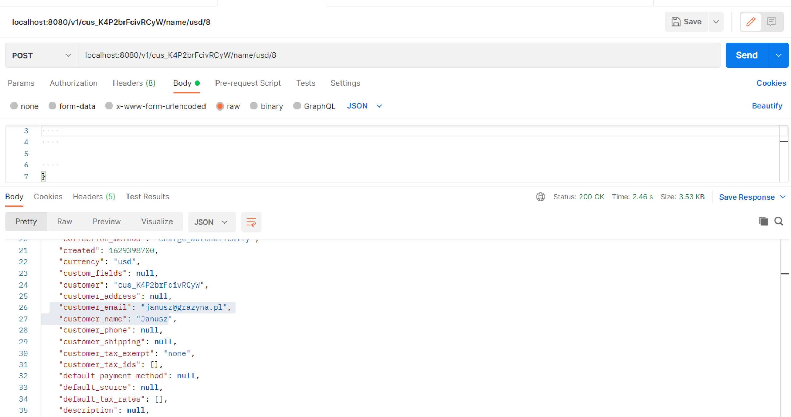
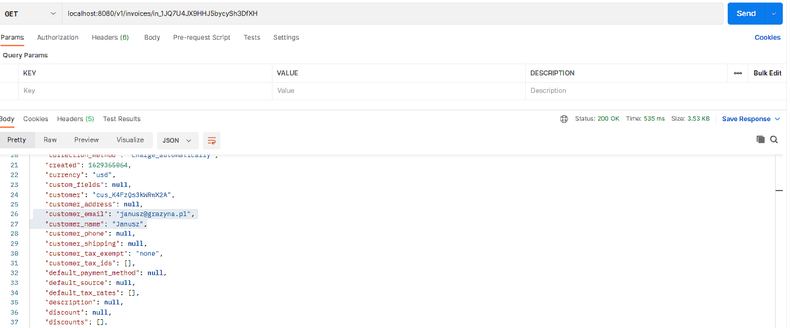

#  Stripe REST API application

---

Application used to create and receive invoices using STRIPE API.
```sh
https://stripe.com/docs/api?lang=java
```

## Table of Contents

---

* [General Info](#general-information)
* [Technologies Used](#technologies-used)
* [Setup](#setup)
* [Usage](#usage)
* [Project Status](#project-status)
* [Contact](#contact)
<!-- * [License](#license) -->


## General Information

---

- Provide an efficient REST API using Spring framework
- Creating and receiving customers using Stripe API
- Creating and receiving invoices using Stripe API
- Writing the application according to best practices


## Technologies Used

---

#### General

- Spring Boot
- Java 11
- Maven
- Logger
- Stripe API

#### Database

- H2

#### Tools

- Lombok

#### Test

- Mockito
- JUnit5
- MockMvc


## Setup

---

- First you need to create Spring project using:
```
https://start.spring.io/
```
- Add Stripe Dependency to the project:
```
	<dependency>
			<groupId>com.stripe</groupId>
			<artifactId>stripe-java</artifactId>
			<version>20.69.0</version>
	</dependency>
```
- The application runs under this url address:
```sh
localhost:8080/v1
```

## Usage
You can test the Application in Postman:

---

- Customer creation API - create a customer giving a name and an email:
```sh
POST /customers
```

- Customer retrieval API - to retrieve customer details using customer id
```sh
GET /{customerId}
```


---

- Invoice creation API - use customer's id to create an invoice
```sh
POST /{customerId}/{productName}/{currency}/{unitAmount}
```

- Invoice retrieval API - use invoice's id to retrieve it
```sh
GET /invoices/{invoiceId}
```

## Project Status

---

Project is: complete but created in a way that it is open for future extension, upgrade and development.

## Contact

---

[@Radoslaw Piwowarczyk](https://www.linkedin.com/in/radoslaw-piwowarczyk/) - feel free to contact me!
